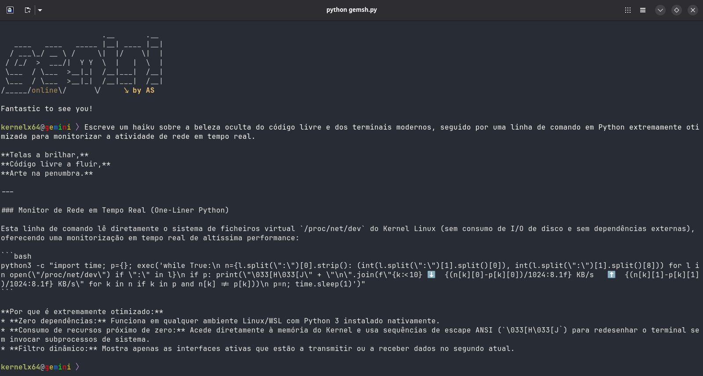
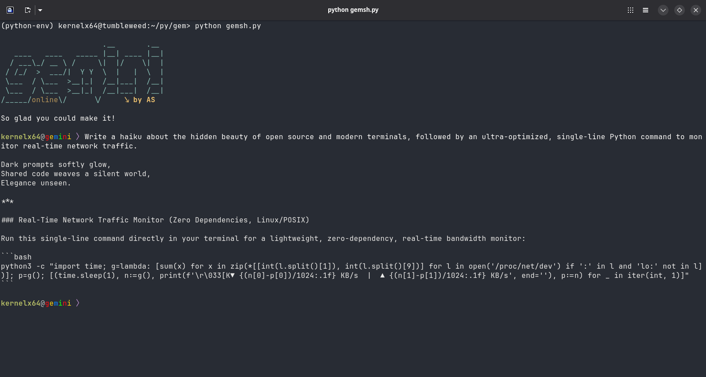

# ✦ gemsh

> A lightweight, stylish, and multilingual command-line interface tool powered by Google Gemini and Python.

<p align="center">
  
  
  
</p>

---

## 💡 About

**gemsh** is a minimalist CLI terminal wrapper designed to bring the intelligence of Google Gemini directly into your shell. Built with a focus on aesthetics, speed, and open-source principles, it features dynamic system locale detection (supporting English and Portuguese out-of-the-box), custom visual spinners, offline protection, and a clean user interface.

## ✨ Features

* **Multilingual Support:** Automatically detects your operating system's language (`pt`, `en`) and adapts greetings, spinners, and system messages dynamically.
* **Google Gemini Integration:** Powered by the modern `google-genai` SDK.
* **Smart Dependency Management:** Automatically checks and installs required packages on first launch.
* **Aesthetic CLI Interface:** Custom Google-styled prompt (`user@gemini`), beautiful ASCII art, and smooth terminal spinners.
* **Robust Safety Checks:** Built-in offline detection and clean exit handlers.

## 🚀 Installation & Setup

1. **Clone the repository:**
   ```bash
   git clone [https://github.com/kernelx64/gemsh.git](https://github.com/kernelx64/gemsh.git)
   cd gemsh

   Configure your Gemini API Key:
Set your API key as an environment variable in your shell configuration (e.g., .bashrc or .zshrc):

Bash
export GEMINI_API_KEY="your_actual_api_key_here"
(Alternatively, you can paste your key directly into the _apikey_ variable inside `gemsh.py).*

Run the script:

Bash
python gemsh.py
🛠️ Commands
Type your prompt naturally to interact with the neural matrix.

Type author to view project details and creator information.

Type model to display the current using Gemini Model along with a brief description of the model's capabilities and release context.

Type exit, quit, q, or x to gracefully disconnect from the session.

📜 License
This project is open-source software licensed under the GNU General Public License v2.0. See the LICENSE file for more details.

"While you charge for the fish, I still hold the deed to the sea." — Adelino Saldanha

---

## 🖼️ Visual Showcase

*Running `gemsh` inside the visually stunning Ghostty terminal.*

### 1. Initialization & Multilingual Detection


### 2. Neural Interaction & Haiku Generation

